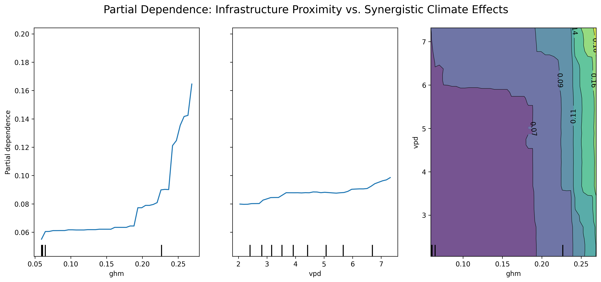
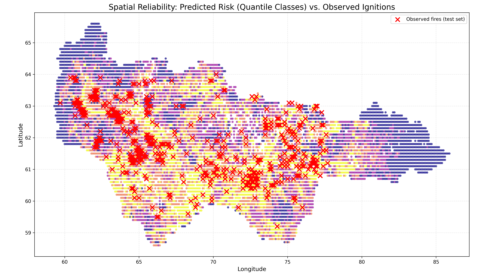
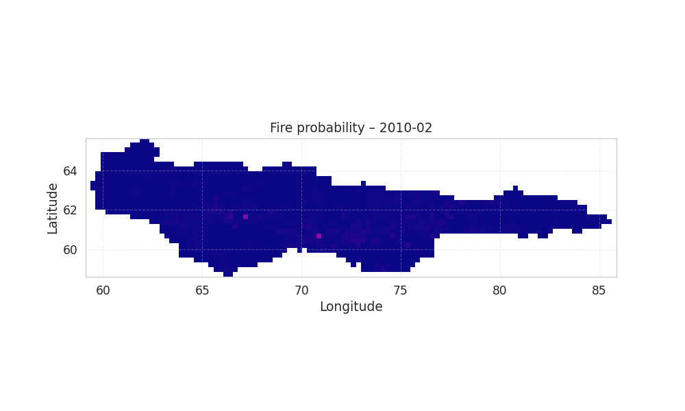
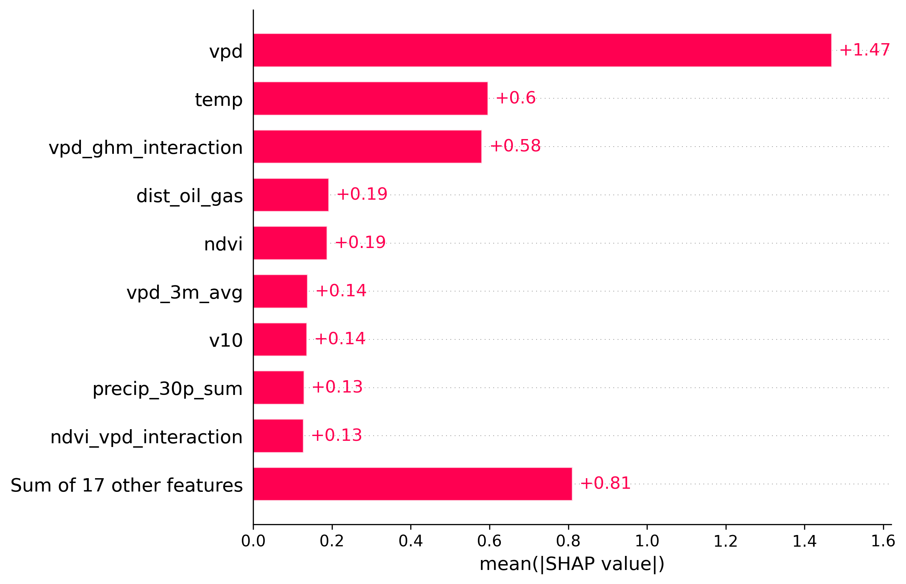
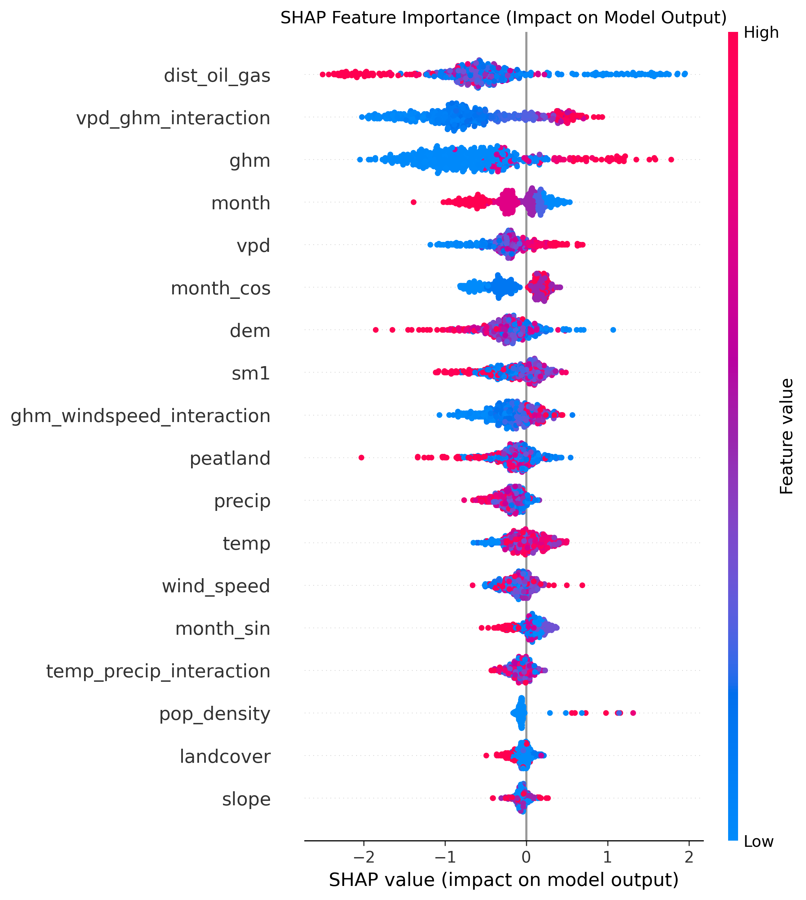
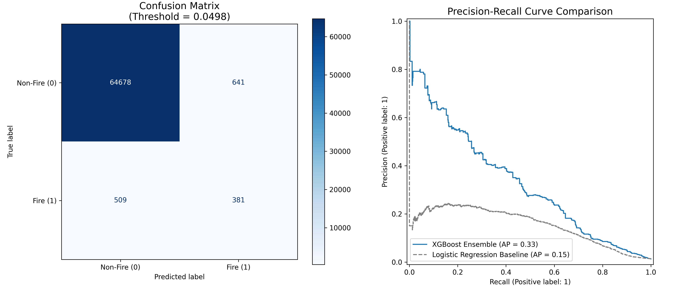
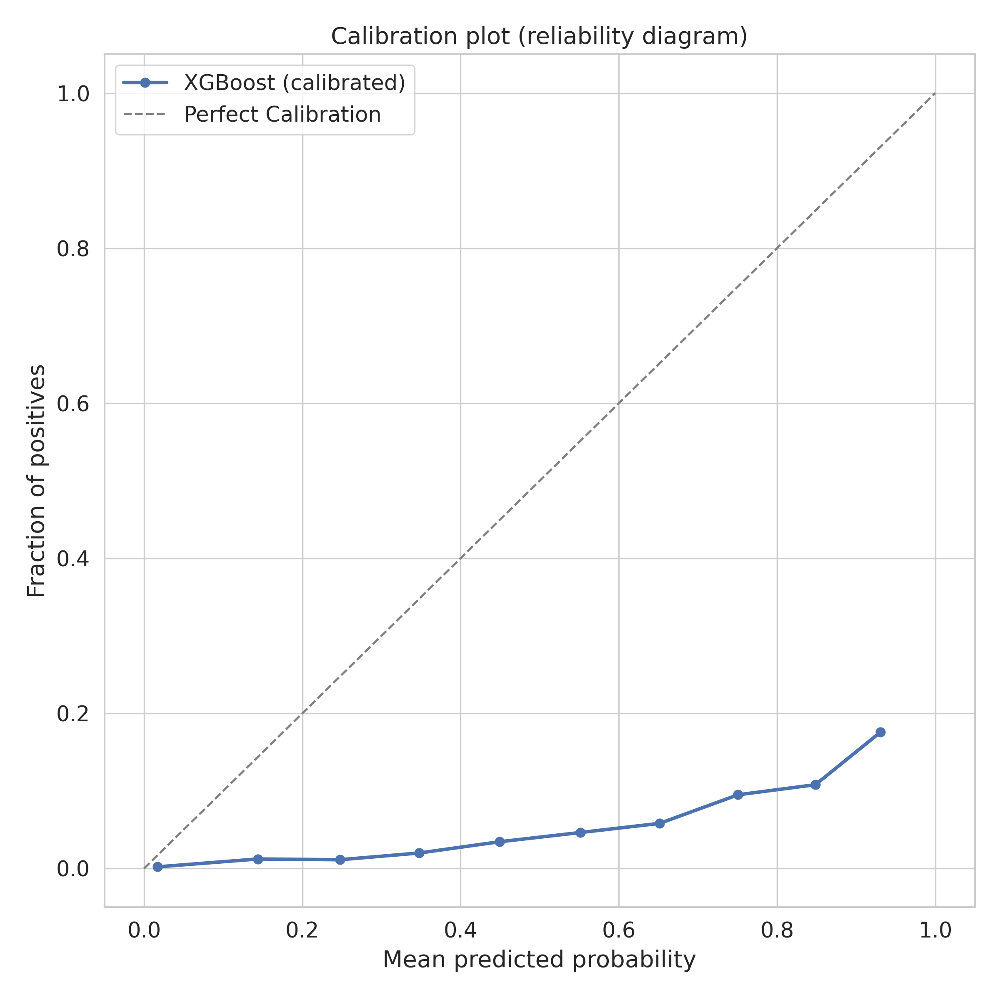
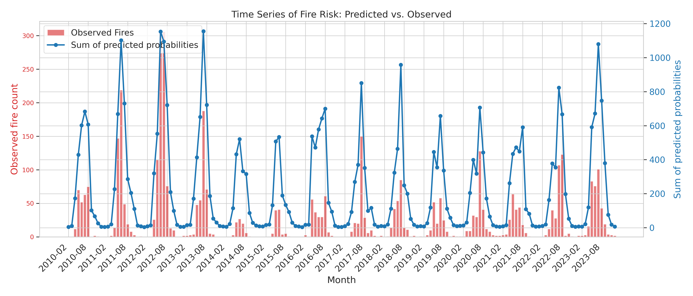

# Wildfire predictive model
#### Paritial Dependence Plots (PDP)

#### Spatial Reliability Map for 2022 (May - September)

#### Animation risk from 2016 to 2025 (May to September)

#### SHAP Summary & Bar

#### Evaluation Aritfacts

#### Calibration Plot

#### Time Series Risk: Predicted vs. Observed
